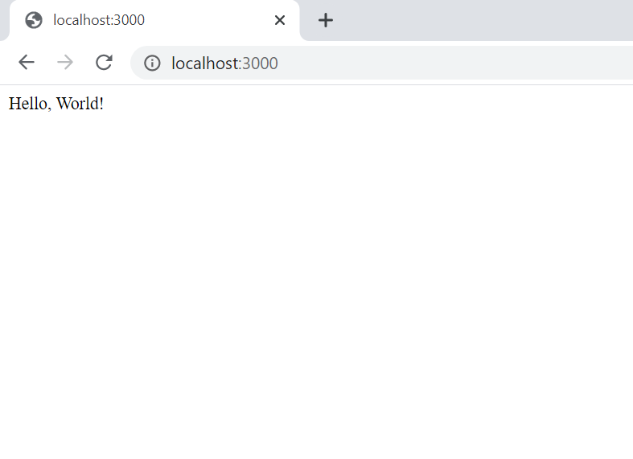

# :zap: Node.js Practise

* Uses Node.js to return 'hello world' from the server

**\* Note: to open web links in a new window use: _ctrl+click on link_**

## :page_facing_up: Table of contents

* [:zap: Node.js Practise](#zap-nodejs-practise)
	* [:page_facing_up: Table of contents](#page_facing_up-table-of-contents)
	* [:books: General info](#books-general-info)
	* [:camera: Screenshots](#camera-screenshots)
	* [:signal_strength: Technologies](#signal_strength-technologies)
	* [:floppy_disk: Setup](#floppy_disk-setup)
	* [:computer: Code Examples](#computer-code-examples)
	* [:cool: Features](#cool-features)
	* [:clipboard: Status & To-Do List](#clipboard-status--to-do-list)
	* [:clap: Inspiration](#clap-inspiration)
	* [:envelope: Contact](#envelope-contact)

## :books: General info

* Basic app using just Express.js but still has 50 dependencies

## :camera: Screenshots

.

## :signal_strength: Technologies

* [Express v4](https://expressjs.com/) Fast, unopinionated, minimalist web framework for Node.js

## :floppy_disk: Setup

* Run `npm run start` or `node server.js` for a dev server.
* Navigate to `http://localhost:3000/` for home screen.
* The app will not automatically reload if you change any of the source files.

## :computer: Code Examples

* extract from `server.js` to close database

```javascript
app.get('/', function (req, res) {
 res.send('Hello, World!');
});
```

## :cool: Features

* none

## :clipboard: Status & To-Do List

* Status: Working
* To-Do: add extra stuff

## :clap: Inspiration

* [FreeCodeCamp](https://www.freecodecamp.org/learn/apis-and-microservices/basic-node-and-express/start-a-working-express-server)

## :envelope: Contact

* Repo created by [ABateman](https://www.andrewbateman.org) - you are welcome to [send me a message](https://andrewbateman.org/contact)
